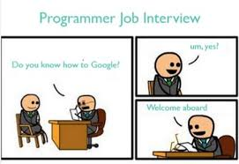

# Überschrift 1 (H1)

## Überschrift 2 (H2)

### Überschrift 3 (H3)

#### Überschrift 4 (H4)

##### Überschrift 5 (H5)

###### Überschrift 6 (H6)

---

ganz normaler Text

**fett**

_kursiv_

~~durchgestrichen~~

**_fett und kursiv_**

[DCI](https://digitalcareerinstitute.org)





<!-- Liste Unterpunkte mit einem Tab erstellen -->

- Erster Punkt
- Zweiter Punkt
  - Erster Unterpunkt
    - Erster Unterunterpunkt

---

```css
h1 {
  background-color: red;
}
```

<!-- inline code -->

`background-color` ist eine css Eigenschaft

---

To-Do Listen

- [x] Markdown lernen
- [ ] Markdown in Projekt anwenden

---

### Tabelle

| Technolgie | Beschreibung                  |
| ---------- | ----------------------------- |
| HTML       | Struckturierung von Webseiten |
| CSS        | Gestaltung von Webseiten      |

---

Markdown ist cool! :smirk:

> "Glaube an dich selbst."

<p style="color: red; text-align:center">Dies ist ein zentrierter roter Text</p>

<details>
    <summary>Klick hier für mehr Details</summary>
    Hier sind zusätzliche Informationnen.
</details>
